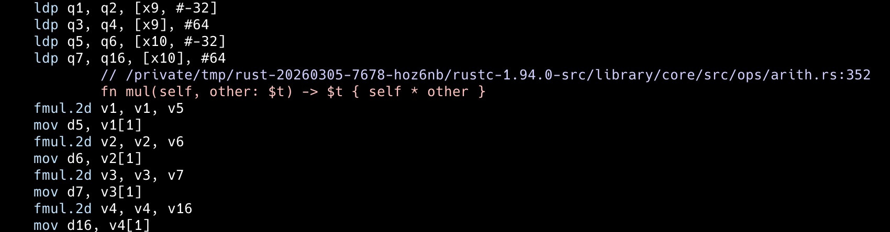

# proxima-ml

Distance and similarity metrics for Rust.

Generic over `f32` and `f64`. Built for ML workloads: batch operations, pairwise matrices and optional multi-threaded computation out of the box.

## Quick start

```toml
[dependencies]
proxima-ml = "0.6"
```

```rust
use proxima_ml::{Distance, Similarity, Euclidean, Cosine};

let a = &[1.0, 2.0, 3.0];
let b = &[4.0, 5.0, 6.0];

let dist = Euclidean::distance(a, b);
let sim = Cosine::similarity(a, b);
```

## Metrics

### Vector metrics

These work on ordered numerical vectors and support `f32`, `f64`, batch operations and ndarray.

| Metric | Type | Description |
|--------|------|-------------|
| `Euclidean` | Distance | Straight-line distance between two points |
| `SqEuclidean` | Distance | Euclidean without the square root, faster when you only need to compare |
| `Manhattan` | Distance | Sum of absolute differences, robust in high dimensions |
| `Chebyshev` | Distance | Maximum difference in any single dimension |
| `Cosine` | Both | Measures direction similarity, ignores magnitude |
| `Dot` | Similarity | Dot product, core operation in neural networks |
| `Canberra` | Distance | Weighted Manhattan, sensitive to small changes near zero |

### Set metrics

These work on categorical or discrete data. Any type that supports equality comparison.

| Metric | Type | Description |
|--------|------|-------------|
| `Hamming` | Distance | Counts positions where two sequences differ |
| `Jaccard` | Both | Measures overlap between two sets |

## Batch operations

Compute distances against many targets at once, or build a condensed pairwise distance matrix:

```rust
use proxima_ml::{DistanceExt, Euclidean};

let query = &[1.0, 2.0, 3.0];
let targets = vec![
    vec![4.0, 5.0, 6.0],
    vec![7.0, 8.0, 9.0],
];

// Distance from query to each target
let distances = Euclidean::batch_distance(query, &targets);

// Condensed pairwise matrix — N*(N-1)/2 distances, no redundancy
let condensed = Euclidean::pdist(&targets);
```

## Parallel computation

Enable the `parallel` feature for multi-threaded batch operations powered by [Rayon](https://crates.io/crates/rayon):

```toml
[dependencies]
proxima-ml = { version = "0.6", features = ["parallel"] }
```

```rust
use proxima_ml::{DistanceExt, Euclidean};

// Same API, just prefixed with par_
let distances = Euclidean::par_batch_distance(query, targets);
let condensed = Euclidean::par_pdist(&points);
```

| Operation | Sequential | Parallel | Speedup |
|-----------|-----------|----------|---------|
| batch_distance (10k × 768d) | 3.2 ms | 449 µs | 7.2x |
| pdist (1k × 128d) | 15.6 ms | 2.6 ms | 6.0x |

Measured on Apple M-series, 15 cores.

## Benchmarks

Single-pair performance, measured on Apple M-series, single-threaded, `f64` vectors:

| Metric | 128d | 768d | 1536d |
|--------|------|------|-------|
| Chebyshev | 22 ns | 126 ns | 259 ns |
| Dot | 27 ns | 308 ns | 717 ns |
| Manhattan | 28 ns | 305 ns | 692 ns |
| Euclidean | 30 ns | 319 ns | 731 ns |
| SqEuclidean | 30 ns | 326 ns | 735 ns |
| Canberra | 48 ns | 379 ns | 786 ns |
| Cosine | 53 ns | 408 ns | 837 ns |

Sorted by 768d performance. f32 vectors are ~10% faster for most metrics and up to 2x faster for Chebyshev. Run `cargo bench` to reproduce on your hardware.

## Under the hood

proxima-ml relies on LLVM auto-vectorization rather than hand-written SIMD. Inspecting the generated assembly with `cargo-show-asm` confirms the compiler produces ARM NEON instructions that process two `f64` values per cycle:



The `fmul.2d` instructions multiply two doubles simultaneously, and `ldp` loads four doubles in a single instruction. The compiler transforms a clean Rust iterator chain into the same SIMD code you'd write by hand.

Cosine similarity uses a fused single-pass algorithm that computes the dot product and both magnitudes in one iteration instead of three. This reduced computation time by 55-61%:

| Dimension | Before | After | Improvement |
|-----------|--------|-------|-------------|
| 128d | 84 ns | 53 ns | 36% |
| 768d | 882 ns | 408 ns | 55% |
| 1536d | 2063 ns | 837 ns | 61% |

## ndarray support

Enable the `ndarray` feature to pass `Array1`, `ArrayView1`, and `Array2` directly to any vector metric:

```toml
[dependencies]
proxima-ml = { version = "0.6", features = ["ndarray"] }
```

```rust
use ndarray::{Array1, Array2};
use proxima_ml::{Distance, DistanceExt, Euclidean};

// Single pair with Array1
let a = Array1::from_vec(vec![1.0, 2.0, 3.0]);
let b = Array1::from_vec(vec![4.0, 5.0, 6.0]);
let dist = Euclidean::distance(&a, &b);

// Batch and pairwise with Array2 (each row is a vector)
let embeddings = Array2::from_shape_vec((3, 3), vec![
    1.0, 2.0, 3.0,
    4.0, 5.0, 6.0,
    7.0, 8.0, 9.0,
]).unwrap();

let condensed = Euclidean::pdist_2d(&embeddings);
let distances = Euclidean::batch_distance_2d(&a, &embeddings);
```

## License

Dual-licensed under [MIT](LICENSE-MIT) and [Apache 2.0](LICENCE-APACHE).
